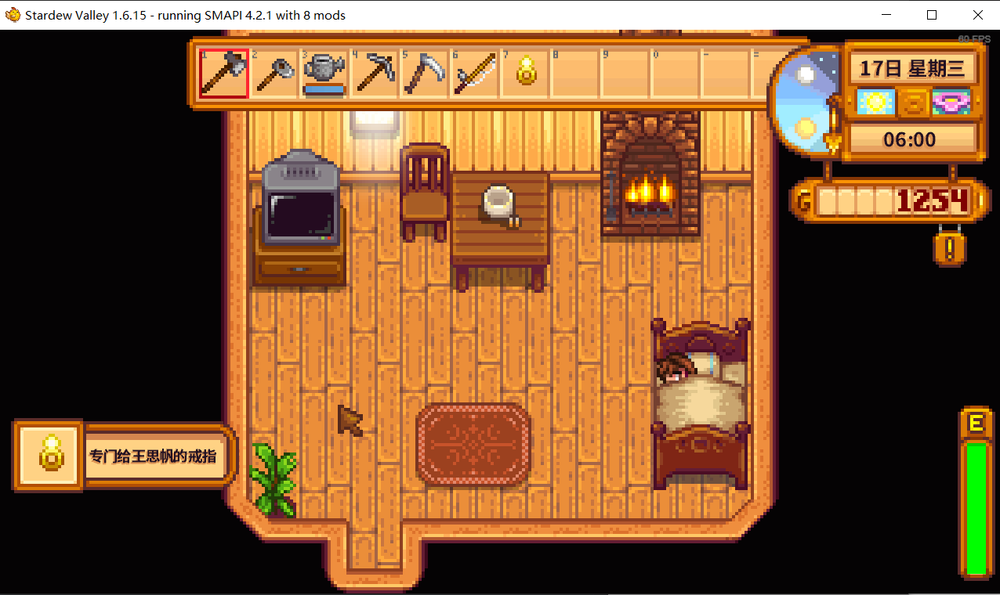

# Stardew-mod

## 写在前面

这是由 `Leejohn` 开发的一个星露谷游戏模组,突发奇想开发了这样一个带有礼物性质的mod❤️


****
## 使用方法

 + 从[N网官网](https://www.nexusmods.com/)搜索 `wsf's_mod` 或者 `id：34663`;
 + 常规 `Manual` 下载,配置 `Mods` 文件夹;
 + 正常加载存档之后，会自动给予戒指💍：’
  


 + 带上**戒指（魔改的辉石戒指）**以后会有自动换装和亮表情特效 (不在此展示了)；

****
### 开发记录

#### 环境选择
+ 本来对于 `.NET` 项目想基于 `VS` 开发但是最后还是选择本地配置 `.NET SDK` 结合 `vscode` 来开发（调试，该参数更方便）
+ 需要 `vscode .NET Install Tool` 扩展。
+ 核心是 `Modentry.cs` 文件继承 `Mod` 类：
 ```c++
      using StardewModdingAPI;
      using StardewModdingAPI.Events;
      using StardewValley;
      using StardewValley.Objects;

      namespace wsf;

      public class Modentry : Mod
      {
          public override void Entry(IModHelper helper)
          {
              Monitor.Log("Initializing Custom Ring Mod", LogLevel.Debug);
              CustomRing.Register(helper, this.Monitor);
              helper.Events.GameLoop.SaveLoaded += OnSaveLoaded;
          }

          private void OnSaveLoaded(object sender, SaveLoadedEventArgs e)
          {
              bool hasRing = false;
              foreach (var item in Game1.player.Items)
              {
                  if (item is Ring ring && ring.GetType() == typeof(CustomRing))
                  {
                      hasRing = true;
                      break;
                  }
              }
              
              if (!hasRing)
              {
                  Game1.player.addItemToInventory(new CustomRing());
                  Monitor.Log("Auto-given custom ring to player", LogLevel.Info);
              }
          }
      }
 ```
 + 在 `CustomRing.cs` 中可以个性化修改戒指事件，在注册戒指分配及穿戴事件之后可以自定义修改消息文本和动作以及表情内容  
```c++
public override void onEquip(Farmer who)
        {
            base.onEquip(who);
            Game1.addHUDMessage(new HUDMessage("text", 1));
            _monitor?.Log($"{who.Name} text!", LogLevel.Info);
            who.animateOnce(id); 
            
            originalHat = who.hat.Value;
            originalShirt = who.shirtItem.Value?.ItemId;
            originalPants = who.pantsItem.Value?.ItemId;
            originalHairColor = who.hairstyleColor.Value;

            who.hat.Value = new Hat("69"); 
            who.changeShirt("1265");  
            who.pantsItem.Value = new Clothing("2"); 
            who.changeGender(who.IsMale);  
            // who.doEmote(20);  
        }
```

****
### 结语

作者和女朋友在星露谷度过了一段极其难忘的时光，齐先生也许见证了我的喜欢和内心的悸动👀，这是她和作者在一起的第一个生日，某天晚上突然有了这样一个想法，遂放手去做，既是对过去自己的喜欢的奖励也是对未来恋爱的激励，正所谓继往开来嘛🤩。
现在功能很单一，后续可能会慢慢更新，可能到最后会变成一个真正有用的 `mod` ，而不仅限于一个 `gift~`。
